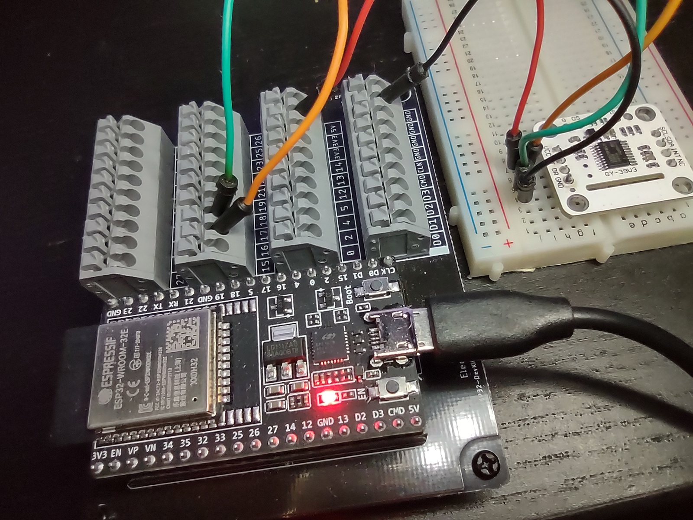

# GY39-Micropython-ESP32

GY-39 MCU Light Intensity Temperature Humidity Atmospheric Pressure, 4 in One Integrated Sensor Module



    # Micropython version
    # With My ESP32 board, UART0 and UART1 are not available
    # Only UART2 is avaiable
    # UART2 is using Rx=GPIO_16, Tx=GPIO_17
    #
    # ESP Pin  --  GY39 Pin
    # ---------------------
    # 3.3v     --  VCC
    # GPIO_16  --  CT 
    # GPIO_17  --  DR
    # GND      --  GND

Working MicroPython code for ESP32 and output are shown below:

```python
# Python version
#import serial

# Micropython version
from machine import UART

# Python version
#def read_int(s) -> int:
#    return int.from_bytes(s.read(1), "big")

# Micropython version
def read_int(s) -> int:
    b = None
    while True:
        if s.any():
            b = s.read(1)
            break
    return int.from_bytes(b, "big")


def read_ints(s, num) -> (list, int):
    lux_buf = []
    tt = 0
    for c in range(num):
        ii = read_int(ser)
        tt += ii
        lux_buf.append(ii)
    return lux_buf, tt


def read_weather(s) -> (int, int, int, int, int):
    s_lux = 0
    s_temperature = 0
    s_pressure = 0
    s_humidity = 0
    s_elevation = 0

    while True:

        running_sum = 0

        lux = 0
        temperature = 0
        pressure = 0
        humidity = 0
        elevation = 0

        i = read_int(ser)
        running_sum += i
        if i == 0x5a:
            i = read_int(ser)
            running_sum += i
            if i == 0x5a:
                i = read_int(ser)
                running_sum += i
                if i == 0x15:
                    i = read_int(ser)
                    running_sum += i
                    payload, ss = read_ints(ser, 4)
                    # print(payload)
                    size = len(payload)
                    l = 0
                    for val in payload:
                        mul = 8 * (size - 1)
                        l += (val << mul)
                        size -= 1
                    lux = l / 100.00
                    running_sum += ss
                    checksum = read_int(ser)
                    # print(hex(checksum))
                    # print(hex(running_sum))
                    if running_sum & 0xff == checksum:
                        # print(f'running sum = {running_sum & 0xff}, checksum = {checksum}')
                        # print(f'lux = {lux} lux')
                        s_lux = lux
                if i == 0x45:
                    i = read_int(ser)
                    running_sum += i
                    payload, ss = read_ints(ser, 2)
                    # print(payload)
                    size = len(payload)
                    t = 0
                    for val in payload:
                        mul = 8 * (size - 1)
                        t += (val << mul)
                        size -= 1
                    temperature = t / 100.00
                    running_sum += ss

                    payload, ss = read_ints(ser, 4)
                    # print(payload)
                    size = len(payload)
                    p = 0
                    for val in payload:
                        mul = 8 * (size - 1)
                        p += (val << mul)
                        size -= 1
                    pressure = p / 100.00
                    running_sum += ss

                    payload, ss = read_ints(ser, 2)
                    # print(payload)
                    size = len(payload)
                    h = 0
                    for val in payload:
                        mul = 8 * (size - 1)
                        h += (val << mul)
                        size -= 1
                    humidity = h / 100.00
                    running_sum += ss

                    payload, ss = read_ints(ser, 2)
                    # print(payload)
                    size = len(payload)
                    e = 0
                    for val in payload:
                        mul = 8 * (size - 1)
                        e += (val << mul)
                        size -= 1
                    elevation = e
                    running_sum += ss

                    checksum = read_int(ser)
                    # print(hex(checksum))
                    # print(hex(running_sum))
                    if running_sum & 0xff == checksum:
                        # print(f'running sum = {running_sum & 0xff}, checksum = {checksum}')
                        # print(f'temperature = {temperature} c')
                        # print(f'pressure = {pressure} pa')
                        # print(f'humidity = {humidity} %')
                        # print(f'elevation = {elevation} m')
                        s_temperature = temperature
                        s_pressure = pressure
                        s_humidity = humidity
                        s_elevation = elevation

        if s_lux != 0 and s_temperature != 0 and s_pressure != 0 and s_humidity != 0 and s_elevation != 0:
            return s_lux, s_temperature, s_pressure, s_humidity, s_elevation


if __name__ == "__main__":

    # Python version for Windows (need FTDI serial to USB dongle)
    #  ser = serial.Serial('COM4', 9600)
    #  ser.flushInput()

    # Micropython version
    # With My ESP32 board, UART0 and UART1 are not available
    # Only UART2 is avaiable
    # UART2 is using Rx=GPIO_16, Tx=GPIO_17
    #
    # ESP Pin  --  GY39 Pin
    # ---------------------
    # 3.3v     --  VCC
    # GPIO_16  --  CT 
    # GPIO_17  --  DR    
    #
    ser = UART(2, 9600)

    (ll, tt, pp, hh, ee) = read_weather(ser)

    print(f'lux = {ll} lux')
    print(f'temperature = {tt} c')
    print(f'pressure = {pp} pa')
    print(f'humidity = {hh} %')
    print(f'elevation = {ee} m')

```

Output:

```
Trial #1
lux = 7.2 lux
temperature = 24.17 c
pressure = 98234.57 pa
humidity = 40.8 %
elevation = 260 m

Trial #2
lux = 424.2 lux
temperature = 23.7 c
pressure = 98228.11 pa
humidity = 40.13 %
elevation = 261 m
```
