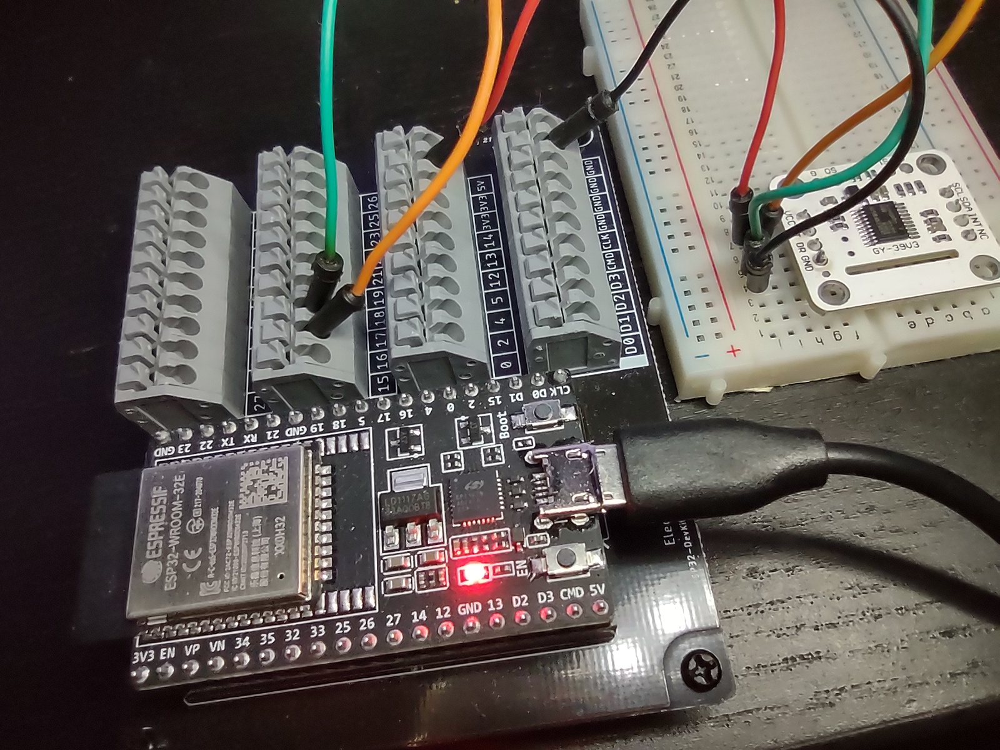
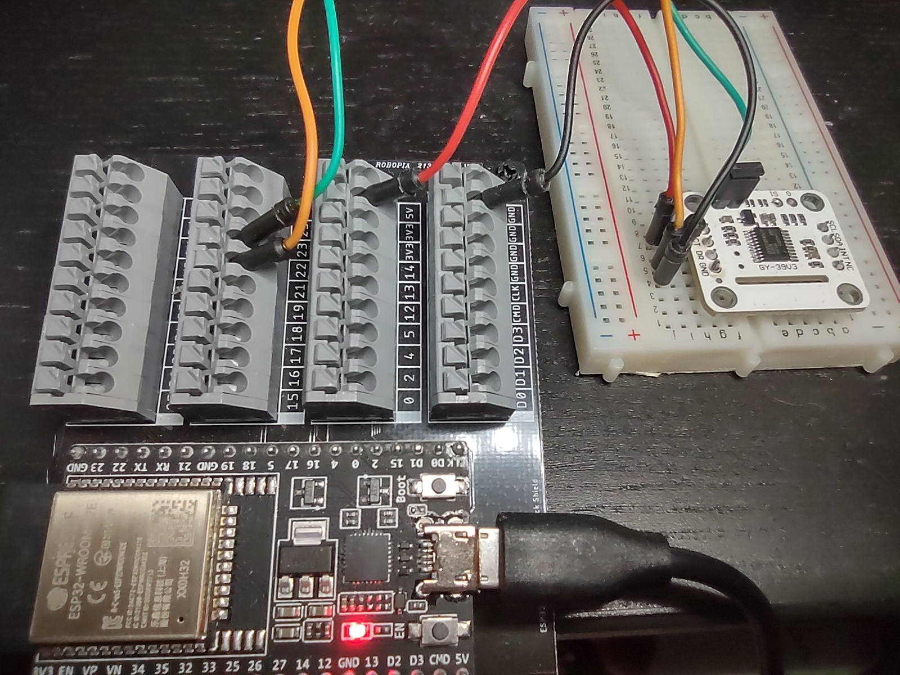

# GY39-Micropython-ESP32

GY-39 MCU Light Intensity Temperature Humidity Atmospheric Pressure, 4 in One Integrated Sensor Module

1. Communication using UART



    # Micropython version
    # With My ESP32 board, UART0 and UART1 are not available
    # Only UART2 is avaiable
    # UART2 is using Rx=GPIO_16, Tx=GPIO_17
    #
    # ESP Pin  --  GY39 Pin
    # ---------------------
    # 3.3v     --  VCC
    # GPIO_16  --  CT 
    # GPIO_17  --  DR
    # GND      --  GND

2. Communication using I2C (S0 to GND)



    # Micropython version
    #
    # ESP Pin  --  GY39 Pin
    # ---------------------
    # 3.3v     --  VCC
    # GPIO_22  --  CT 
    # GPIO_21  --  DR
    # GND      --  GND    

Working MicroPython code for ESP32 can be downloaded from this repository and here are some outputs:

```
Trial #1:
lux = 7.2 lux
temperature = 24.17 c
pressure = 98234.57 pa
humidity = 40.8 %
elevation = 260 m

Trial #2:
lux = 424.2 lux
temperature = 23.7 c
pressure = 98228.11 pa
humidity = 40.13 %
elevation = 261 m
```
